# LifeLine — Diagramas de Arquitetura (gerados a partir do código)

> Gerado por leitura direta de `src/lib/*.server.ts` e `src/routes/app/**` (+ um passo dentro de `src/components/clinic/*` sempre que um componente de tela chamava uma `*.functions.ts` diretamente — sem isso, várias arestas reais teriam ficado de fora). Nenhuma relação abaixo foi desenhada sem um `import` ou `.from("...")` correspondente no código. Rodada: 2026-08-16, commit `6edb185`.
>
> **Atualização incremental (2026-08-16, mesmo dia):** nó `memedBenchFn` (`src/lib/api/memed-bench.functions.ts`) adicionado ao diagrama da Seção 1 — server functions exclusivas da bancada `memed-simulacao.tsx` (histórico/protocolos/impressão da Memed), sempre via prescritor sintético. Resto do diagrama não reverificado nesta atualização.

---

## 1. Arquitetura — telas → server functions → lib → persistência → serviços externos

```mermaid
flowchart TB
    subgraph TELAS["🖥️ TELAS — src/routes/app/** (médico)"]
        route["route.tsx (shell)"]
        idx["index.tsx (Kanban)"]
        pacIdx["pacientes.index.tsx (Lista)"]
        pacId["pacientes.$id.tsx (Prontuário)"]
        memedSim["memed-simulacao.tsx"]
        perfil["perfil.tsx"]
        produtos["produtos.index.tsx"]
    end

    subgraph SERVERFN["⚙️ SERVER FUNCTIONS — src/lib/api/*.functions.ts"]
        authFn["auth.functions"]
        clinicFn["clinic.functions"]
        servicesFn["services.functions"]
        templatesFn["templates.functions"]
        memedCatFn["memed-catalog.functions"]
        memedBenchFn["memed-bench.functions"]
        categoriesFn["categories.functions"]
        apptTypesFn["appointment-types.functions"]
        transcribeFn["transcribe.functions"]
        criteriosFn["criterios.functions"]
        docsFn["docs.functions"]
        pubFn["publications.functions"]
    end

    subgraph LIB["📚 LIB — src/lib/*.server.ts"]
        authSrv["auth.server"]
        patientsSrv["patients.server"]
        registrySrv["patients-registry.server"]
        accessSrv["patient-access.server"]
        categoriesSrv["categories.server"]
        apptTypesSrv["appointment-types.server"]
        boardSrv["board.server"]
        agendaSrv["agenda.server"]
        billingSrv["billing.server"]
        memedSrv["memed.server"]
        memedCatSrv["memed-catalog.server"]
        whatsappSrv["whatsapp.server"]
        paymentsSrv["payments.server"]
        recordsSrv["records.server"]
        measurementsSrv["measurements.server"]
        ocrSrv["ocr-extraction.server"]
        geminiClientSrv["gemini-client.server"]
        loincSrv["loinc-mapping.server"]
        rateLimitSrv["rate-limit.server"]
        accessLogSrv["access-log.server"]
        resilientSrv["resilient.server"]
        triageSrv["triage.server"]
        servicesSrv["services.server"]
        templatesSrv["templates.server"]
        criteriosSrv["criterios.server"]
        docsSrv["docs.server"]
        pubSrv["publications.server"]
        emailSrv["email.server"]
        dbSrv["db.server (readRows/mutateRows)"]
        storeSrv["store.server (fs direto)"]
    end

    subgraph PERSIST["🗄️ PERSISTÊNCIA"]
        kv[("Postgres · kv_collections\n(1 tabela, JSON por coleção:\ndoctors/patients/sessions/\ncategories/services/boards/\ncharges/evolutions/templates/\nmemed_catalog/access_log...)")]
        measurementsTbl[("Postgres · measurements")]
        apptTbl[("Postgres · appointments")]
        criteriosTbl[("Postgres · criterios")]
        docsTbl[("Postgres · docs")]
        pubTbl[("Postgres · publications")]
        loincTbl[("Postgres · loinc_pt_br")]
        localJson[("Filesystem local .data/*.json\nfeedback / consultations /\nprescriptions — efêmero,\nsó cache do /admin")]
    end

    subgraph EXTERNAL["☁️ SERVIÇOS EXTERNOS"]
        gemini(["Gemini API\ngenerativelanguage.googleapis.com"])
        memedApi(["Memed REST API\napi.memed.com.br"])
        resend(["Resend (e-mail)"])
        stripe(["Stripe API\napi.stripe.com"])
        whatsappApi(["WhatsApp Cloud API\ngraph.facebook.com"])
        pubmed(["PubMed/NCBI E-utilities\n+ RSS JAMA/NEJM"])
    end

    %% telas -> server functions
    route --> authFn
    route -->|"via KnowledgeDrawer"| criteriosFn
    route -->|"via KnowledgeDrawer"| docsFn
    route -->|"via KnowledgeDrawer"| pubFn

    idx --> clinicFn
    idx -->|"via AppointmentCalendar"| categoriesFn
    idx -->|"via AppointmentCalendar"| apptTypesFn

    pacIdx --> clinicFn

    pacId --> clinicFn
    pacId --> servicesFn
    pacId --> templatesFn
    pacId --> memedCatFn
    pacId -->|"via Dictation"| transcribeFn

    memedSim --> clinicFn
    memedSim --> memedCatFn
    memedSim --> memedBenchFn

    perfil --> clinicFn

    produtos --> servicesFn

    %% server functions -> lib
    authFn --> authSrv
    authFn --> emailSrv
    authFn --> rateLimitSrv

    clinicFn --> authSrv
    clinicFn --> categoriesSrv
    clinicFn --> apptTypesSrv
    clinicFn --> patientsSrv
    clinicFn --> registrySrv
    clinicFn --> accessSrv
    clinicFn --> triageSrv
    clinicFn --> boardSrv
    clinicFn --> agendaSrv
    clinicFn --> billingSrv
    clinicFn --> memedSrv
    clinicFn --> whatsappSrv
    clinicFn --> paymentsSrv
    clinicFn --> recordsSrv
    clinicFn --> measurementsSrv
    clinicFn --> ocrSrv
    clinicFn --> loincSrv
    clinicFn --> rateLimitSrv
    clinicFn --> accessLogSrv
    clinicFn --> resilientSrv

    categoriesFn --> authSrv
    categoriesFn --> categoriesSrv
    apptTypesFn --> authSrv
    apptTypesFn --> apptTypesSrv
    servicesFn --> authSrv
    servicesFn --> servicesSrv
    templatesFn --> authSrv
    templatesFn --> templatesSrv
    memedCatFn --> authSrv
    memedCatFn --> memedCatSrv
    memedCatFn --> memedSrv
    memedBenchFn --> authSrv
    memedBenchFn --> memedSrv
    transcribeFn --> authSrv
    transcribeFn --> geminiClientSrv
    criteriosFn --> authSrv
    criteriosFn --> criteriosSrv
    docsFn --> authSrv
    docsFn --> docsSrv
    pubFn --> authSrv
    pubFn --> pubSrv

    %% lib -> lib (reuso interno real)
    templatesSrv --> geminiClientSrv
    recordsSrv --> storeSrv

    %% lib -> persistência (kv_collections, via db.server)
    authSrv --> dbSrv
    patientsSrv --> dbSrv
    registrySrv --> dbSrv
    accessSrv --> dbSrv
    categoriesSrv --> dbSrv
    apptTypesSrv --> dbSrv
    boardSrv --> dbSrv
    billingSrv --> dbSrv
    recordsSrv --> dbSrv
    servicesSrv --> dbSrv
    templatesSrv --> dbSrv
    memedCatSrv --> dbSrv
    accessLogSrv --> dbSrv
    dbSrv --> kv

    %% lib -> Postgres dedicado (bypassa db.server)
    measurementsSrv --> measurementsTbl
    agendaSrv --> apptTbl
    criteriosSrv --> criteriosTbl
    docsSrv --> docsTbl
    docsSrv -.->|"lê p/ promover doc"| pubTbl
    pubSrv --> pubTbl
    pubSrv -.->|"grava linked_doc_id"| docsTbl
    loincSrv --> loincTbl

    %% lib -> filesystem local
    storeSrv --> localJson

    %% lib -> externos
    geminiClientSrv --> gemini
    ocrSrv -->|"fetch próprio, não reusa gemini-client.server"| gemini
    criteriosSrv --> gemini
    memedSrv --> memedApi
    emailSrv --> resend
    paymentsSrv --> stripe
    whatsappSrv --> whatsappApi
    pubSrv --> pubmed

    classDef tela fill:#1e6e4f,color:#fff,stroke:#144a35
    classDef serverfn fill:#2f8f66,color:#fff,stroke:#1e6e4f
    classDef lib fill:#e8f4ee,color:#1a1a1a,stroke:#2f8f66
    classDef shared fill:#6b4c9a,color:#fff,stroke:#4a3269
    classDef persist fill:#666,color:#fff,stroke:#333
    classDef ext fill:#666,color:#fff,stroke:#333

    class route,idx,pacIdx,pacId,memedSim,perfil,produtos tela
    class authFn,clinicFn,servicesFn,templatesFn,memedCatFn,memedBenchFn,categoriesFn,apptTypesFn,criteriosFn,docsFn,pubFn serverfn
    class transcribeFn shared
    class authSrv,patientsSrv,registrySrv,accessSrv,categoriesSrv,apptTypesSrv,boardSrv,agendaSrv,billingSrv,memedSrv,memedCatSrv,whatsappSrv,paymentsSrv,recordsSrv,servicesSrv,templatesSrv,criteriosSrv,docsSrv,pubSrv,emailSrv,rateLimitSrv,accessLogSrv,resilientSrv,triageSrv lib
    class measurementsSrv,ocrSrv,geminiClientSrv,loincSrv,dbSrv,storeSrv shared
    class kv,measurementsTbl,apptTbl,criteriosTbl,docsTbl,pubTbl,loincTbl,localJson persist
    class gemini,memedApi,resend,stripe,whatsappApi,pubmed ext
```

### Notas de leitura (o que o código realmente faz, não o que "parece")

- **`db.server.ts` não é mais JSON em disco — é Postgres.** O arquivo tem comentário explícito no código: a versão antiga gravava em `.data/*.json`; em runtime de edge/Worker o filesystem é read-only, então a escrita caía silenciosamente e cada isolate novo começava vazio (era a causa da sessão do médico "caindo"). Hoje `readRows`/`mutateRows` leem e gravam uma linha JSON por coleção na tabela `kv_collections` do Supabase/Postgres. Os arquivos `doctors.json`, `patients.json`, `sessions.json` etc. continuam existindo em `.data/` no disco local, mas são **artefato de dev/gitignored, não a fonte de verdade** — `git check-ignore` confirma `.data/` no `.gitignore`.
- **`measurements.server.ts`, `agenda.server.ts`, `criterios.server.ts`, `docs.server.ts`, `publications.server.ts` e `loinc-mapping.server.ts` não passam por `db.server.ts`.** Cada um chama `supabaseAdmin` diretamente contra sua própria tabela Postgres dedicada — são um padrão de persistência genuinamente diferente do `kv_collections`, mesmo estando no mesmo banco.
- **`ocr-extraction.server.ts` duplica o cliente Gemini** em vez de reusar `gemini-client.server.ts` — os dois têm implementações de fetch/upload/poll paralelas e independentes contra a mesma API. `criterios.server.ts` chama `generateGeminiText` (de `gemini-client.server.ts`) para gerar rascunho de critério; `templates.server.ts` faz o mesmo para rascunho de template — essas duas reusam o cliente, só o OCR não.
- **`payments.server.ts` e `stripe.server.ts` são dois clientes Stripe diferentes e desconectados.** `payments.server.ts` (usado por `clinic.functions.ts`, alcançável de `/app`) faz `fetch` direto em `api.stripe.com` para gerar link de cobrança avulsa. `stripe.server.ts` (SDK `stripe` + um gateway `connector-gateway.lovable.dev/stripe`) só é importado por `src/lib/subscription.functions.ts` e `src/routes/api/public/payments/webhook.ts` — um fluxo de **assinatura SaaS** que não tem nenhuma tela em `src/routes/app/**` apontando pra ele. Não desenhei essa segunda cadeia no diagrama acima porque nada em `/app` a referencia; ela existe, mas é uma ilha.
- **A tabela `subscriptions` existe na migração/`types.ts` do Supabase mas não tem nenhum `.from("subscriptions")` em `src/lib`** — schema definido, sem código de aplicação usando (na área lida).
- **`leads.functions.ts` grava em dois lugares ao mesmo tempo**: insere na tabela Postgres `leads` (client anônimo, chave publicável) *e* espelha em `.data/leads.json` via `store.server.ts` "pro dashboard /admin continuar funcionando" (comentário no próprio código).

---

## 2. Modelo de dados — entidades persistidas hoje

```mermaid
erDiagram
    DOCTORS ||--o{ SESSIONS : "token de login"
    DOCTORS ||--o{ PATIENTS : "dono do prontuário"
    DOCTORS ||--o{ CATEGORIES : ""
    DOCTORS ||--o{ APPOINTMENT_TYPES : ""
    DOCTORS ||--o{ SERVICES : ""
    DOCTORS ||--o{ TEMPLATES : ""
    DOCTORS ||--o{ EVOLUTIONS : "autor"
    DOCTORS ||--o{ CHARGES : ""
    DOCTORS ||--o{ APPOINTMENTS : ""
    DOCTORS ||--o{ MEASUREMENTS : "confirmou"
    DOCTORS ||--o{ CRITERIOS : ""
    DOCTORS ||--o{ DOCS : ""
    DOCTORS ||--o{ PUBLICATIONS : "feed pessoal"
    DOCTORS ||--o{ MEMED_CATALOG : "cache Memed"

    PATIENTS }o--|| DOCTORS : "doctorId"
    PATIENTS ||--o{ EVOLUTIONS : "prontuário"
    PATIENTS ||--o{ CHARGES : ""
    PATIENTS ||--o{ APPOINTMENTS : ""
    PATIENTS ||--o{ MEASUREMENTS : "biomarcadores oficiais"
    PATIENTS }o--o| PATIENTS_REGISTRY : "globalId (nullable, BKL-37)"

    PATIENTS_REGISTRY ||--o{ PATIENT_ACCESS_GRANTS : "token presencial"
    PATIENTS_REGISTRY ||--o| PATIENT_ACCOUNTS : "globalId (paciente logado)"
    PATIENTS_REGISTRY ||--o{ PATIENT_PENDING_MEASUREMENTS : "rascunho enviado pelo paciente"

    PATIENT_ACCOUNTS ||--o{ PATIENT_MEDICATIONS : ""
    PATIENT_ACCOUNTS ||--o{ PATIENT_METRICS : ""

    DOCS }o--o| PUBLICATIONS : "source_publication_id"
    PUBLICATIONS }o--o| DOCS : "linked_doc_id"

    DOCTORS {
        string id PK
        string email
        string provider "email|google"
        string crm
        string especialidade
    }
    PATIENTS {
        string id PK
        string doctorId FK
        string patientCode "LFL-XXXX, único por médico"
        string globalId FK "null até vínculo BKL-37"
        string cpf
    }
    PATIENTS_REGISTRY {
        string globalId PK
        string publicCode "LifeLine ID público"
        string fullName
        string cpf
        json patientProfile "autodeclarado"
    }
    PATIENT_ACCOUNTS {
        string id PK
        string globalId FK
        string email "login do paciente"
    }
    MEASUREMENTS {
        string id PK
        string doctor_id FK
        string patient_id FK
        string name
        float value
        float ref_min
        float ref_max
        string loinc_code
    }
    PATIENT_PENDING_MEASUREMENTS {
        string id PK
        string global_id FK "NÃO tem doctor_id nem patient_id"
        bool confirmed_by_doctor "sempre false na criação"
        string loinc_code
    }
    APPOINTMENTS {
        string id PK
        string doctor_id FK
        string patient_id FK "nullable"
    }
    EVOLUTIONS {
        string id PK
        string doctorId FK
        string patientId FK
        json sealed "selo SHA-256, congela edição"
        json prescription "código Memed"
    }
    CHARGES {
        string id PK
        string doctorId FK
        string patientId FK
    }
    CRITERIOS {
        string id PK
        string doctor_id FK
        string kind
    }
    DOCS {
        string id PK
        string doctor_id FK
        string source_publication_id FK "nullable"
    }
    PUBLICATIONS {
        string id PK
        string doctor_id FK
        string linked_doc_id FK "nullable"
    }
    LOINC_PT_BR {
        string loinc_code PK
        string nome_pt "catálogo global, sem FK de doctor/patient"
    }
    LEADS {
        string id PK
        string email "sem FK — captação de marketing"
    }
    MEMED_CATALOG {
        string id PK
        string doctorId FK "cache local do catálogo Memed"
    }
```

### Notas de leitura do ER

- **`PATIENT_PENDING_MEASUREMENTS` não tem `doctor_id` nem `patient_id`** — só `global_id`. É estruturalmente impossível um rascunho de exame do paciente "vazar" direto pro prontuário de um médico sem uma ação que crie esse vínculo explicitamente (bate com a "barreira vermelha" que o PRD descreve na Seção 2.1). A promoção pra `MEASUREMENTS` (que aí sim tem `doctor_id`/`patient_id`) não existe ainda como código lido nesta rodada — não desenhei essa seta porque não achei o import/chamada que faz essa transição.
- **`PATIENTS.globalId` é de fato nullable e só setado uma vez** (`linkPatientToGlobalId` só grava se ainda for `null`, conforme comentário em `clinic-types.ts`) — condiz com BKL-37 estar listado como pendência no PRD.
- **Entidades do lado paciente** (`PATIENT_ACCOUNTS`, `PATIENT_MEDICATIONS`, `PATIENT_METRICS`, `PATIENT_PENDING_MEASUREMENTS`) foram confirmadas por leitura de `src/lib/*.server.ts`, mas nenhuma tela em `src/routes/app/**` as referencia — consistente com o princípio PM-09 do PRD ("app do paciente nunca é gated pelo médico", pilhas paralelas). Não vi `src/routes/paciente/**` nesta rodada (fora do escopo pedido), então não afirmo nada sobre como essas entidades aparecem pro paciente — só que existem e são alcançáveis a partir de `src/lib`.
- **`LOINC_PT_BR` e `LEADS` não têm nenhuma FK para médico/paciente** — são tabelas de referência/captação, corretamente desconectadas do grafo clínico.
- Não incluí `SUBSCRIPTIONS` no ER porque, apesar de estar no schema Postgres (`types.ts`), não achei nenhum `.from("subscriptions")` dentro de `src/lib` — incluir a entidade sem uma relação real seria inventar uma aresta.

---

## 3. Onde a realidade diverge do `LifeLine_PRD_Handover_v6.docx`

| # | O que o PRD v6 diz | O que o código mostra (lido nesta rodada) | Impacto |
|---|---|---|---|
| 1 | Seção 4: *"Persistência: `db.server.ts` (readRows/mutateRows) sobre `.data/*.json`... **Ainda não é Postgres** — ver risco na Seção 9"*. Seção 9 lista JSON-no-filesystem como risco ativo não resolvido. | `db.server.ts` grava e lê de uma tabela Postgres (`kv_collections`) — o próprio arquivo tem um comentário datado explicando a migração e o bug de produção que ela corrigiu (sessão "caindo" em runtime edge). `.data/*.json` está no `.gitignore` e não é mais lido em produção. | **O risco #1 do PRD (Seção 9) já foi resolvido no código.** O documento está descrevendo um estado anterior — isso muda a prioridade de qualquer decisão que dependa dessa seção. |
| 2 | Seção 4/PRD todo: *"Prontuário oficial: `measurements.server.ts` / `patients.server.ts` / `records.server.ts`"* listados juntos como se tivessem a mesma persistência. Nenhuma menção a tabelas Postgres dedicadas por entidade. | `measurements.server.ts` usa uma tabela Postgres própria (`measurements`), com comentário `DAT-02` dizendo que essa tabela **já existia com RLS**, mas o app "nunca tinha sido religado pra usá-la" — ou seja, isso foi uma mudança recente e explícita. O mesmo padrão (tabela dedicada + comentário `DAT-02`) aparece em `agenda.server.ts`, `patient-measurements.server.ts`, `criterios.server.ts`, `docs.server.ts`, `publications.server.ts`, `loinc-mapping.server.ts`. | O PRD trata "persistência" como uma decisão única e pendente; na prática já existem **três mecanismos coexistindo** (kv_collections genérico, tabelas Postgres dedicadas, JSON local efêmero em `store.server.ts`). Vale documentar os três, não um. |
| 3 | Nenhuma menção a Memed na arquitetura da Seção 2 (a "Figura 1" descrita cobre só Google e Gemini como externos). | `memed.server.ts` (adaptador REST completo pra API da Memed, com ambiente sandbox/live) é chamado por `clinic.functions.ts` e `memed-catalog.functions.ts`, e alimenta a tela `memed-simulacao.tsx` e o fluxo de prescrição em `pacientes.$id.tsx`. Existe inclusive `LifeLine_Referencia_Memed.md` no repo, com 24 páginas de doc oficial consolidadas. | A Memed é uma integração externa de primeira classe (emite receita real) e não aparece no diagrama de arquitetura do PRD v6 — é a maior lacuna entre os dois. |
| 4 | Seção 10, "Perguntas em Aberto": *"Validação do modelo de dados financeiro (Cobranças) — pendente desde a v3."* | Existem **dois** sistemas de cobrança no código: (a) `payments.server.ts` — link de cobrança avulsa via Stripe, alcançável de `/app` via `clinic.functions.ts`; (b) `stripe.server.ts` + `src/lib/subscription.functions.ts` + `src/routes/api/public/payments/webhook.ts` — assinatura recorrente com webhook, **sem nenhuma tela em `/app` apontando pra ele**. | A "pergunta em aberto" do PRD já tem uma resposta parcial no código — só que são duas respostas diferentes e desconectadas, o que é provavelmente a própria causa da pendência. |
| 5 | Seção 5.4: *"Pipeline de OCR ... real, compartilhado ... `ocr-extraction.server.ts` chama o Gemini"* — descrito como uma peça única. | Existem **dois clientes Gemini distintos**: `gemini-client.server.ts` (reusado por `templates.server.ts`, `criterios.server.ts` e `transcribe.functions.ts`) e uma implementação de fetch/upload/poll paralela dentro do próprio `ocr-extraction.server.ts`, que não reusa o primeiro. | Não é uma divergência de arquitetura, é uma de manutenção: duas implementações do mesmo protocolo (upload de arquivo + poll + generateContent) divergem silenciosamente se uma for corrigida e a outra não. |
| 6 | Seção 4/5: nenhuma menção a fontes médicas externas (PubMed, RSS de journals). | `publications.server.ts` chama `eutils.ncbi.nlm.nih.gov` (PubMed) e RSS da JAMA/NEJM, alimentando `KnowledgeDrawer` (visível a partir de `route.tsx`, ou seja, em toda tela `/app`). | Mais uma integração externa real (`PubMed/NCBI + RSS`) ausente do diagrama de arquitetura do PRD. |
| 7 | Glossário, Seção 11: *"token (compartilhamento) — Permissão temporária de um médico ver dado de outro médico. Feature 7, **NÃO implementado**. Não existe ainda."* | `patient-access.server.ts` existe e implementa exatamente isso — `createAccessRequest`, `consumeToken`, `hasActiveGrant`, `findValidPresentialToken` — consumido por `clinic.functions.ts`. | Não confirmei se é o mesmo conceito descrito na Feature 7 do PRD (não achei o documento da Feature 7 nesta leitura) — mas o glossário do próprio PRD v6 marca esse mecanismo como inexistente, e o código tem uma implementação funcional dele. Vale checar se são a mesma coisa ou dois conceitos com nome parecido antes de assumir. |
| 8 | Seção 4: n/a — PRD não fala de mirror/dual-write. | `leads.functions.ts` grava simultaneamente na tabela Postgres `leads` (client anônimo) e em `.data/leads.json` via `store.server.ts`, "pro dashboard /admin continuar funcionando" (comentário no código). `records.server.ts` também grava evolução no Postgres (via `db.server`) e, em paralelo, loga em `.data/consultations.json`/`prescriptions.json` (JSON local efêmero) só para contadores do `/admin`. | Não é uma divergência do PRD em si, mas é o tipo de detalhe que qualquer atualização da Seção 4 do PRD devia registrar — hoje existe escrita duplicada silenciosa em dois pontos do sistema. |

---

## 4. Sugestões para melhorar a criação (e manutenção) destes diagramas

1. **Gerar a partir de um script, não à mão.** Um script simples (ts-morph, `madge`, ou até `grep` disciplinado como fiz aqui) sobre `import`/`.from("...")` real produz o grafo de dependências automaticamente. À mão, cada rodada de handover corre o risco de descrever o estado de duas versões atrás (foi exatamente o que aconteceu com a Seção 4/9 do PRD v6 — o risco "ainda não é Postgres" já não existe). Um `npm run diagram` que roda `madge --image arch.svg src/lib` (ou equivalente) e é commitado junto do PR que muda persistência resolveria isso de raiz.
2. **Ampliar o escopo de leitura para `src/routes/paciente/**`, `src/routes/admin/**` e `src/routes/api/**` numa segunda rodada.** Esta rodada leu só `src/routes/app/**` (médico) por instrução explícita — mas isso deixou de fora o lado paciente inteiro (mesmo as entidades que ele persiste, como `PATIENT_ACCOUNTS`/`PATIENT_MEDICATIONS`, terem sido confirmadas via `src/lib`), o fluxo de assinatura Stripe (`subscription.functions.ts` + webhook) e o painel `/admin`. O diagrama de arquitetura do PRD promete cobrir os dois lados (médico + paciente) — hoje só dá pra afirmar com confiança o lado médico.
3. **Anotar cada aresta do diagrama de persistência com o mecanismo, não só a seta.** "vai pro banco" hoje significa três coisas diferentes no código (kv_collections genérico / tabela Postgres dedicada / arquivo local efêmero via `store.server.ts`). Um diagrama que trata os três como "Postgres" sem diferenciar esconde exatamente o tipo de risco que a Seção 9 do PRD tenta capturar.
4. **Adicionar uma legenda de "não conectado"** para peças de código reais que existem mas não têm nenhuma aresta de entrada a partir das telas lidas (ex.: `stripe.server.ts`/assinatura, `SUBSCRIPTIONS` no schema). Isso evita duas leituras erradas do mesmo silêncio: "não existe" vs. "existe mas está órfão" são conclusões muito diferentes, e só a segunda é verdadeira aqui.
5. **Congelar a convenção de cor do PRD (médico verde / paciente coral / compartilhado roxo / persistência-externo cinza) num arquivo de estilo reusável** (ex.: um bloco `classDef` num `.mermaid` compartilhado) para que cada rodada de diagrama não precise redecidir a paleta — reduz o tipo de deriva que já existe entre v5 e v6 do PRD.
6. **Versionar o diagrama junto do código que ele descreve**, não só no handover. Um `ARCHITECTURE.md` na raiz do repo (como já existe para `LifeLine_Referencia_Memed.md`) que o PR de uma mudança de persistência é obrigado a tocar reduziria a distância entre "o que o PRD diz" e "o que o código faz" — que hoje é a maior fonte de retrabalho encontrada nesta auditoria.
