# LIFELINE — Ecossistema Médico Inteligente
## PRD & HANDOVER COMPLETO — v7

Handover técnico e de produto, reconstruído por leitura direta do código nesta rodada (2026-08-16, commit `6edb185`). Primeira versão gerada para alimentar especificamente o **Project Build**, com processo explícito para propagar pros Projects Discovery e Growth.

Projeto BUILD · Agosto 2026 · Confidencial · Uso Interno
Repositório: `github.com/DanielEvo/lifeline-doc` · App: `lifeline-doc.lovable.app/app`

---

## 0. Como usar este documento

Escrito pra servir de handover completo — inclusive pra alguém que não participou de nenhuma conversa anterior. Cada seção carrega uma tag de proveniência, porque essa é a lição da própria v6: metade das divergências encontradas nesta rodada existiam porque uma seção antiga foi tratada como ainda-verdadeira sem checar.

**Tags de proveniência** (novas na v7):
- `[Verificado v7]` — confirmado por leitura direta do código nesta rodada (2026-08-16).
- `[Herdado v6]` — carregado do PRD anterior sem reverificação nesta rodada. Trate como "provavelmente ainda verdade", não como fato confirmado.
- `[Não coberto]` — área que existe no produto mas não foi lida nesta rodada (ver escopo abaixo).

**Convenção de responsabilidade** (mantida da v6):
- `[Claude Code]` — lógica de servidor, modelo de dados, guards de autenticação, integrações externas.
- `[Lovable]` — telas, formulários, componentes visuais, wiring de UI.
- `[Ambos]` — a tarefa tem parte de cada lado.

### 0.1 Escopo desta rodada

Lido nesta rodada: `src/lib/*.server.ts` (todos os 36 arquivos) e `src/routes/app/**` (lado médico), mais um passo dentro de `src/components/clinic/*` sempre que um componente de tela chamava uma `*.functions.ts` direto. Também lido: `src/integrations/supabase/types.ts`, `supabase/migrations/*.sql`, `.gitignore`, e o próprio `LifeLine_PRD_Handover_v6.docx`.

**Não coberto nesta rodada** (herdado da v6 ou marcado como lacuna, não confirmado de novo): `src/routes/paciente/**` (app do paciente), `src/routes/admin/**`, `src/routes/api/**` (inclusive o webhook de pagamento), `src/lib/subscription.functions.ts`. Qualquer afirmação sobre essas áreas abaixo é `[Herdado v6]` ou `[Não coberto]` — não `[Verificado v7]`.

### 0.2 Papel deste documento entre Discovery / Build / Growth

Hoje existem três Projects Claude pro LifeLine (Discovery, Build, Growth) e o risco é o mesmo que gerou as divergências desta rodada: cada um mantendo sua própria cópia da realidade técnica, sem trigger para atualizar quando o código muda.

Proposta de processo:

1. **Este documento é a fonte única de "o que existe hoje"** (arquitetura, modelo de dados, integrações, riscos técnicos). Só é editado a partir de leitura de código no Project Build — nunca escrito de memória, nunca editado a partir de Discovery ou Growth.
2. **Discovery e Growth consomem, não escrevem, as seções técnicas.** Quando iniciar uma sessão em Discovery ou Growth que precise de contexto técnico, suba este arquivo (ou a versão mais recente) como Project knowledge, substituindo a anterior — não deixe as duas versões coexistindo no mesmo Project.
3. **Seções de estratégia, pesquisa de usuário, posicionamento e métricas de growth continuam vivendo em Discovery/Growth**, não aqui — este PRD só descreve o sistema como ele é, não o porquê de negócio. A Seção 3 (Princípios de Produto) é a única ponte: decisões de produto que têm consequência técnica direta.
4. **Cadência de regeneração**: antes de qualquer rodada de planejamento que dependa de arquitetura (não de UI/copy), regerar as Seções 2, 4 e 9 a partir do código — o resto do documento muda com menos frequência.
5. **Todo PR que muda persistência, uma integração externa, ou uma entidade de dado deveria tocar este arquivo** (ou pelo menos abrir uma pendência pra atualizá-lo) — é o hábito que teria evitado a divergência #1 da Seção 12.

---

## 1. Sumário Executivo `[Verificado v7 na parte técnica / Herdado v6 na parte de produto]`

O LifeLine é um produto de dois lados rodando no mesmo `/app`: o consultório do médico (maduro — Kanban, prontuário, agenda, cobrança, OCR real de exames, prescrição digital via Memed, base de conhecimento clínico com PubMed/RSS) e o app do paciente (autenticação própria, identidade global, perfil autodeclarado — não relido nesta rodada).

A mudança mais importante desde a v6: **a persistência não é mais JSON em filesystem — é Postgres**, e essa migração já resolveu o risco #1 que a v6 listava como ativo. Em troca, apareceram três mecanismos de persistência coexistindo (Seção 4) e duas integrações que a v6 não documentava (Memed, PubMed/RSS). Detalhe completo na Seção 12 (changelog).

---

## 2. Arquitetura Atual — Diagrama `[Verificado v7]`

Diagrama construído por leitura direta do código nesta rodada. Cinco camadas: telas → server functions → lib → persistência → serviços externos. Regra aplicada: nenhuma aresta sem um `import` ou `.from("...")` correspondente no código.

```mermaid
flowchart TB
    subgraph TELAS["🖥️ TELAS — src/routes/app/** (médico)"]
        route["route.tsx (shell)"]
        idx["index.tsx (Kanban)"]
        pacIdx["pacientes.index.tsx (Lista)"]
        pacId["pacientes.$id.tsx (Prontuário)"]
        memedSim["memed-simulacao.tsx"]
        perfil["perfil.tsx"]
        produtos["produtos.index.tsx"]
    end

    subgraph SERVERFN["⚙️ SERVER FUNCTIONS — src/lib/api/*.functions.ts"]
        authFn["auth.functions"]
        clinicFn["clinic.functions"]
        servicesFn["services.functions"]
        templatesFn["templates.functions"]
        memedCatFn["memed-catalog.functions"]
        memedBenchFn["memed-bench.functions"]
        categoriesFn["categories.functions"]
        apptTypesFn["appointment-types.functions"]
        transcribeFn["transcribe.functions"]
        criteriosFn["criterios.functions"]
        docsFn["docs.functions"]
        pubFn["publications.functions"]
    end

    subgraph LIB["📚 LIB — src/lib/*.server.ts"]
        authSrv["auth.server"]
        patientsSrv["patients.server"]
        registrySrv["patients-registry.server"]
        accessSrv["patient-access.server"]
        categoriesSrv["categories.server"]
        apptTypesSrv["appointment-types.server"]
        boardSrv["board.server"]
        agendaSrv["agenda.server"]
        billingSrv["billing.server"]
        memedSrv["memed.server"]
        memedCatSrv["memed-catalog.server"]
        whatsappSrv["whatsapp.server"]
        paymentsSrv["payments.server"]
        recordsSrv["records.server"]
        measurementsSrv["measurements.server"]
        ocrSrv["ocr-extraction.server"]
        geminiClientSrv["gemini-client.server"]
        loincSrv["loinc-mapping.server"]
        rateLimitSrv["rate-limit.server"]
        accessLogSrv["access-log.server"]
        resilientSrv["resilient.server"]
        triageSrv["triage.server"]
        servicesSrv["services.server"]
        templatesSrv["templates.server"]
        criteriosSrv["criterios.server"]
        docsSrv["docs.server"]
        pubSrv["publications.server"]
        emailSrv["email.server"]
        dbSrv["db.server (readRows/mutateRows)"]
        storeSrv["store.server (fs direto)"]
    end

    subgraph PERSIST["🗄️ PERSISTÊNCIA"]
        kv[("Postgres · kv_collections\n(1 tabela, JSON por coleção:\ndoctors/patients/sessions/\ncategories/services/boards/\ncharges/evolutions/templates/\nmemed_catalog/access_log...)")]
        measurementsTbl[("Postgres · measurements")]
        apptTbl[("Postgres · appointments")]
        criteriosTbl[("Postgres · criterios")]
        docsTbl[("Postgres · docs")]
        pubTbl[("Postgres · publications")]
        loincTbl[("Postgres · loinc_pt_br")]
        localJson[("Filesystem local .data/*.json\nfeedback / consultations /\nprescriptions — efêmero,\nsó cache do /admin")]
    end

    subgraph EXTERNAL["☁️ SERVIÇOS EXTERNOS"]
        gemini(["Gemini API\ngenerativelanguage.googleapis.com"])
        memedApi(["Memed REST API\napi.memed.com.br"])
        resend(["Resend (e-mail)"])
        stripe(["Stripe API\napi.stripe.com"])
        whatsappApi(["WhatsApp Cloud API\ngraph.facebook.com"])
        pubmed(["PubMed/NCBI E-utilities\n+ RSS JAMA/NEJM"])
    end

    route --> authFn
    route -->|"via KnowledgeDrawer"| criteriosFn
    route -->|"via KnowledgeDrawer"| docsFn
    route -->|"via KnowledgeDrawer"| pubFn

    idx --> clinicFn
    idx -->|"via AppointmentCalendar"| categoriesFn
    idx -->|"via AppointmentCalendar"| apptTypesFn

    pacIdx --> clinicFn

    pacId --> clinicFn
    pacId --> servicesFn
    pacId --> templatesFn
    pacId --> memedCatFn
    pacId -->|"via Dictation"| transcribeFn

    memedSim --> clinicFn
    memedSim --> memedCatFn
    memedSim --> memedBenchFn

    perfil --> clinicFn

    produtos --> servicesFn

    authFn --> authSrv
    authFn --> emailSrv
    authFn --> rateLimitSrv

    clinicFn --> authSrv
    clinicFn --> categoriesSrv
    clinicFn --> apptTypesSrv
    clinicFn --> patientsSrv
    clinicFn --> registrySrv
    clinicFn --> accessSrv
    clinicFn --> triageSrv
    clinicFn --> boardSrv
    clinicFn --> agendaSrv
    clinicFn --> billingSrv
    clinicFn --> memedSrv
    clinicFn --> whatsappSrv
    clinicFn --> paymentsSrv
    clinicFn --> recordsSrv
    clinicFn --> measurementsSrv
    clinicFn --> ocrSrv
    clinicFn --> loincSrv
    clinicFn --> rateLimitSrv
    clinicFn --> accessLogSrv
    clinicFn --> resilientSrv

    categoriesFn --> authSrv
    categoriesFn --> categoriesSrv
    apptTypesFn --> authSrv
    apptTypesFn --> apptTypesSrv
    servicesFn --> authSrv
    servicesFn --> servicesSrv
    templatesFn --> authSrv
    templatesFn --> templatesSrv
    memedCatFn --> authSrv
    memedCatFn --> memedCatSrv
    memedCatFn --> memedSrv
    memedBenchFn --> authSrv
    memedBenchFn --> memedSrv
    transcribeFn --> authSrv
    transcribeFn --> geminiClientSrv
    criteriosFn --> authSrv
    criteriosFn --> criteriosSrv
    docsFn --> authSrv
    docsFn --> docsSrv
    pubFn --> authSrv
    pubFn --> pubSrv

    templatesSrv --> geminiClientSrv
    recordsSrv --> storeSrv

    authSrv --> dbSrv
    patientsSrv --> dbSrv
    registrySrv --> dbSrv
    accessSrv --> dbSrv
    categoriesSrv --> dbSrv
    apptTypesSrv --> dbSrv
    boardSrv --> dbSrv
    billingSrv --> dbSrv
    recordsSrv --> dbSrv
    servicesSrv --> dbSrv
    templatesSrv --> dbSrv
    memedCatSrv --> dbSrv
    accessLogSrv --> dbSrv
    dbSrv --> kv

    measurementsSrv --> measurementsTbl
    agendaSrv --> apptTbl
    criteriosSrv --> criteriosTbl
    docsSrv --> docsTbl
    docsSrv -.->|"lê p/ promover doc"| pubTbl
    pubSrv --> pubTbl
    pubSrv -.->|"grava linked_doc_id"| docsTbl
    loincSrv --> loincTbl

    storeSrv --> localJson

    geminiClientSrv --> gemini
    ocrSrv -->|"fetch próprio, não reusa gemini-client.server"| gemini
    criteriosSrv --> gemini
    memedSrv --> memedApi
    emailSrv --> resend
    paymentsSrv --> stripe
    whatsappSrv --> whatsappApi
    pubSrv --> pubmed

    classDef tela fill:#1e6e4f,color:#fff,stroke:#144a35
    classDef serverfn fill:#2f8f66,color:#fff,stroke:#1e6e4f
    classDef lib fill:#e8f4ee,color:#1a1a1a,stroke:#2f8f66
    classDef shared fill:#6b4c9a,color:#fff,stroke:#4a3269
    classDef persist fill:#666,color:#fff,stroke:#333
    classDef ext fill:#666,color:#fff,stroke:#333

    class route,idx,pacIdx,pacId,memedSim,perfil,produtos tela
    class authFn,clinicFn,servicesFn,templatesFn,memedCatFn,memedBenchFn,categoriesFn,apptTypesFn,criteriosFn,docsFn,pubFn serverfn
    class transcribeFn shared
    class authSrv,patientsSrv,registrySrv,accessSrv,categoriesSrv,apptTypesSrv,boardSrv,agendaSrv,billingSrv,memedSrv,memedCatSrv,whatsappSrv,paymentsSrv,recordsSrv,servicesSrv,templatesSrv,criteriosSrv,docsSrv,pubSrv,emailSrv,rateLimitSrv,accessLogSrv,resilientSrv,triageSrv lib
    class measurementsSrv,ocrSrv,geminiClientSrv,loincSrv,dbSrv,storeSrv shared
    class kv,measurementsTbl,apptTbl,criteriosTbl,docsTbl,pubTbl,loincTbl,localJson persist
    class gemini,memedApi,resend,stripe,whatsappApi,pubmed ext
```

```mermaid
erDiagram
    DOCTORS ||--o{ SESSIONS : "token de login"
    DOCTORS ||--o{ PATIENTS : "dono do prontuário"
    DOCTORS ||--o{ CATEGORIES : ""
    DOCTORS ||--o{ APPOINTMENT_TYPES : ""
    DOCTORS ||--o{ SERVICES : ""
    DOCTORS ||--o{ TEMPLATES : ""
    DOCTORS ||--o{ EVOLUTIONS : "autor"
    DOCTORS ||--o{ CHARGES : ""
    DOCTORS ||--o{ APPOINTMENTS : ""
    DOCTORS ||--o{ MEASUREMENTS : "confirmou"
    DOCTORS ||--o{ CRITERIOS : ""
    DOCTORS ||--o{ DOCS : ""
    DOCTORS ||--o{ PUBLICATIONS : "feed pessoal"
    DOCTORS ||--o{ MEMED_CATALOG : "cache Memed"

    PATIENTS }o--|| DOCTORS : "doctorId"
    PATIENTS ||--o{ EVOLUTIONS : "prontuário"
    PATIENTS ||--o{ CHARGES : ""
    PATIENTS ||--o{ APPOINTMENTS : ""
    PATIENTS ||--o{ MEASUREMENTS : "biomarcadores oficiais"
    PATIENTS }o--o| PATIENTS_REGISTRY : "globalId (nullable, BKL-37)"

    PATIENTS_REGISTRY ||--o{ PATIENT_ACCESS_GRANTS : "token presencial"
    PATIENTS_REGISTRY ||--o| PATIENT_ACCOUNTS : "globalId (paciente logado)"
    PATIENTS_REGISTRY ||--o{ PATIENT_PENDING_MEASUREMENTS : "rascunho enviado pelo paciente"

    PATIENT_ACCOUNTS ||--o{ PATIENT_MEDICATIONS : ""
    PATIENT_ACCOUNTS ||--o{ PATIENT_METRICS : ""

    DOCS }o--o| PUBLICATIONS : "source_publication_id"
    PUBLICATIONS }o--o| DOCS : "linked_doc_id"

    DOCTORS {
        string id PK
        string email
        string provider "email|google"
        string crm
        string especialidade
    }
    PATIENTS {
        string id PK
        string doctorId FK
        string patientCode "LFL-XXXX, único por médico"
        string globalId FK "null até vínculo BKL-37"
        string cpf
    }
    PATIENTS_REGISTRY {
        string globalId PK
        string publicCode "LifeLine ID público"
        string fullName
        string cpf
        json patientProfile "autodeclarado"
    }
    PATIENT_ACCOUNTS {
        string id PK
        string globalId FK
        string email "login do paciente"
    }
    MEASUREMENTS {
        string id PK
        string doctor_id FK
        string patient_id FK
        string name
        float value
        float ref_min
        float ref_max
        string loinc_code
    }
    PATIENT_PENDING_MEASUREMENTS {
        string id PK
        string global_id FK "NÃO tem doctor_id nem patient_id"
        bool confirmed_by_doctor "sempre false na criação"
        string loinc_code
    }
    APPOINTMENTS {
        string id PK
        string doctor_id FK
        string patient_id FK "nullable"
    }
    EVOLUTIONS {
        string id PK
        string doctorId FK
        string patientId FK
        json sealed "selo SHA-256, congela edição"
        json prescription "código Memed"
    }
    CHARGES {
        string id PK
        string doctorId FK
        string patientId FK
    }
    CRITERIOS {
        string id PK
        string doctor_id FK
        string kind
    }
    DOCS {
        string id PK
        string doctor_id FK
        string source_publication_id FK "nullable"
    }
    PUBLICATIONS {
        string id PK
        string doctor_id FK
        string linked_doc_id FK "nullable"
    }
    LOINC_PT_BR {
        string loinc_code PK
        string nome_pt "catálogo global, sem FK de doctor/patient"
    }
    LEADS {
        string id PK
        string email "sem FK — captação de marketing"
    }
    MEMED_CATALOG {
        string id PK
        string doctorId FK "cache local do catálogo Memed"
    }
```

### 2.1 Leitura do diagrama `[Verificado v7]`

- **A persistência tem três mecanismos coexistindo, não um.** (a) `kv_collections` — uma única tabela Postgres, uma linha JSON por "coleção" (`doctors.json`, `patients.json`...), acessada via `db.server.ts`; (b) tabelas Postgres dedicadas — `measurements`, `patient_pending_measurements`, `appointments`, `criterios`, `docs`, `publications`, `loinc_pt_br`, `leads`, cada uma acessada direto por `supabaseAdmin` no seu próprio `*.server.ts`, sem passar por `db.server.ts`; (c) filesystem local efêmero (`.data/*.json` via `store.server.ts`) — só `feedback`, `consultations` e `prescriptions`, que existem pra alimentar contadores do `/admin`, não são fonte de verdade clínica.
- **A barreira entre paciente e médico continua estrutural, não só de UI.** `PATIENT_PENDING_MEASUREMENTS` não tem `doctor_id` nem `patient_id` — só `global_id`. Não existe um caminho de código que promova um item pendente pra `MEASUREMENTS` automaticamente.
- **Memed é uma integração de primeira classe**, não um detalhe de UI: `memed.server.ts` é um adaptador REST completo (sandbox/live, JWT de prescritor, timeout próprio) chamado por duas telas de `/app` (`pacientes.$id.tsx`, `memed-simulacao.tsx`).
- **Existe uma base de conhecimento clínico que a v6 não documentava**: `criterios.server.ts` (critérios diagnósticos, com rascunho gerado por Gemini), `docs.server.ts` (documentos salvos pelo médico) e `publications.server.ts` (busca em PubMed/NCBI + RSS de JAMA/NEJM) — as três alimentam o `KnowledgeDrawer`, visível em toda tela de `/app` a partir do shell (`route.tsx`).
- **Duas peças de código estão desconectadas do que roda em `/app`** e por isso não entraram no diagrama: `stripe.server.ts` (SDK Stripe + gateway da Lovable) só é usado por `src/lib/subscription.functions.ts` e por `src/routes/api/public/payments/webhook.ts` — um fluxo de assinatura SaaS sem nenhuma tela em `/app` apontando pra ele. A tabela `subscriptions` existe no schema Postgres mas não tem nenhum `.from("subscriptions")` em `src/lib`.

---

## 3. Princípios de Produto Consolidados `[Herdado v6]`

Carregado sem alteração — são decisões de produto, não afirmações sobre o código, e nada nesta rodada as contradisse.

- **PM-09** — App do paciente nunca é gated por ação do médico.
- **Identidade não é acesso** — achar que um paciente "já existe" (por CPF) nunca libera dado clínico nenhum sozinho. Evita vazamento de metadado sensível (TECH-13).
- **Match de identidade só é iniciado pelo médico** — nunca o paciente auto-vincula a um registro pré-existente.
- **Dado que o paciente digita ou envia nunca vira fato clínico sozinho** — fica "autodeclarado"/"aguardando revisão" até confirmação médica explícita. `[Verificado v7]` — confirmado estruturalmente na Seção 2.1: `PATIENT_PENDING_MEASUREMENTS` não tem FK pra prontuário do médico.
- **Faixa de referência nunca é mostrada ao paciente antes da confirmação médica** — filtrado no servidor, não escondido só na UI.
- **IA é sempre "assistida por IA"** na comunicação com o médico — nunca fraseado que sugira decisão autônoma da máquina.
- **Recuperação de senha nunca revela se um e-mail existe na base** — mesma resposta em ambos os casos, para ambos os lados.

---

## 4. Arquitetura Técnica — Tabela de Referência `[Verificado v7]`

| Camada | Arquivo(s) | Nota |
|---|---|---|
| Frontend | React 19 · TanStack Router (file-based) · Tailwind v4 · shadcn/ui · Recharts | `[Herdado v6]`, não reverificado — sem sinal de mudança. |
| Servidor | TanStack Start (`createServerFn`) · Zod | Toda função exige token e resolve identidade no servidor. |
| **Persistência genérica** | `db.server.ts` (`readRows`/`mutateRows`) sobre a tabela Postgres `kv_collections` | **Corrigido da v6**: não é mais `.data/*.json`. Uma linha JSON por coleção (`doctors`, `patients`, `sessions`, `categories`, `services`, `boards`, `charges`, `evolutions`, `templates`, `memed_catalog`, `access_log`...). Cache em memória de 2s por isolate. |
| **Persistência dedicada** | `measurements.server.ts`, `agenda.server.ts`, `criterios.server.ts`, `docs.server.ts`, `publications.server.ts`, `loinc-mapping.server.ts` | Cada um com sua própria tabela Postgres (RLS deny-all/service-role-only), acessada direto via `supabaseAdmin` — não passa por `db.server.ts`. |
| **Persistência efêmera** | `store.server.ts` sobre `.data/*.json` local | Só `feedback`, `leads` (mirror), `consultations`, `prescriptions` — cache do `/admin`, cai em memória se o filesystem não for gravável. |
| Auth médico | `auth.server.ts` / `auth.functions.ts` / `session.ts` | `[Herdado v6]` no fluxo (SHA-256+salt, Google, reset de senha) — persistência confirmada `[Verificado v7]` (via `db.server.ts`/`kv_collections`). |
| Auth paciente | `patient-auth.server.ts` / `patient-auth.functions.ts` | `[Não coberto]` nesta rodada — `src/routes/paciente/**` não foi lido. Persistência confirmada `[Verificado v7]`: mesma tabela `kv_collections`, coleções `patient_accounts`/`patient_sessions`. |
| Identidade global | `patients-registry.server.ts` | `globalId` + perfil autodeclarado, via `kv_collections`. |
| OCR / extração | `ocr-extraction.server.ts` | Gemini real, compartilhado, nunca grava. Implementação de cliente Gemini **duplicada** — não reusa `gemini-client.server.ts` (ver Seção 8). |
| Base de conhecimento | `criterios.server.ts` / `docs.server.ts` / `publications.server.ts` | **Novo desde a v6**: critérios diagnósticos com rascunho por Gemini, documentos do médico, e busca em PubMed/RSS — três tabelas Postgres dedicadas, com link bidirecional `docs.source_publication_id` ⇄ `publications.linked_doc_id`. |
| Prescrição digital | `memed.server.ts` / `memed-catalog.server.ts` | **Ausente da v6**: adaptador REST completo pra Memed (sandbox/live), mais um cache de catálogo em `kv_collections`. |
| Draft de exame paciente | `patient-measurements.server.ts` | `[Não coberto]` no fluxo de tela — persistência confirmada `[Verificado v7]`: tabela Postgres `patient_pending_measurements`, nunca vira oficial sozinho. |
| Prontuário oficial | `measurements.server.ts` / `patients.server.ts` / `records.server.ts` | Fonte única de verdade clínica — mas em **dois mecanismos diferentes**: `measurements` é tabela Postgres dedicada; `patients`/`evolutions` vivem em `kv_collections`. |
| Cobrança avulsa | `payments.server.ts` | Link de cobrança via Stripe (`fetch` direto em `api.stripe.com`), alcançável de `/app` via `clinic.functions.ts`. |
| Assinatura SaaS | `stripe.server.ts` + `subscription.functions.ts` + `routes/api/public/payments/webhook.ts` | **Desconectado de `/app`** — SDK Stripe + gateway `connector-gateway.lovable.dev/stripe`, sem tela apontando pra ele. `[Não coberto]` em profundidade. |

---

## 5. O Que Já Existe — Detalhado

### 5.1 Autenticação — Google OAuth real, recuperação de senha `[Herdado v6, não reverificado]`

Conteúdo mantido da v6 sem alteração — esta rodada não releu `auth.functions.ts`/`patient-auth.functions.ts` em profundidade de fluxo, só confirmou onde a persistência aterrissa (Seção 4). Antes de tratar como ainda-verdadeiro, reverificar: fluxo OAuth 2.0 real vs. fallback dev, expiração/uso único de token de reset, envio de e-mail (simulado vs. real).

### 5.2 Identidade global do paciente — registry (TECH-13) `[Verificado v7 na estrutura de dados / Herdado v6 no fluxo]`

`patients-registry.server.ts` grava `globalId`, nome, CPF/RG opcionais, contato, nascimento, sexo e `patientProfile` (tipo sanguíneo, alergias) na coleção `patients_registry` (`kv_collections`). `PATIENTS.globalId` é nullable e só é setado uma vez — confirmado em código: `linkPatientToGlobalId` só grava se ainda for `null`. `patientCode` (LFL-XXXX, por médico) e `globalId` (pessoa, cross-médico) continuam sem ligação automática — bate com BKL-37 ainda pendente.

### 5.3 Pipeline de OCR / extração de exame `[Verificado v7]`

`ocr-extraction.server.ts` chama o Gemini pra ler PDF/imagem e devolver biomarcadores candidatos — nunca grava. **Divergência de manutenção nova**: este arquivo tem sua própria implementação de upload/poll/generateContent, paralela à de `gemini-client.server.ts` (que é reusada por `templates.server.ts` e `criterios.server.ts`). Corrigir uma sem a outra é um risco silencioso.

### 5.4 Prescrição digital — Memed `[Verificado v7, ampliado em 2026-08-16 — ver 8.11]`

`memed.server.ts` resolve ambiente (sandbox/live) e host de API por variável de ambiente, nunca simula token — sem credencial ou perfil incompleto, cai em erro explícito (`not_configured`/`missing_profile`). `memed-catalog.server.ts` mantém um cache local do catálogo de medicamentos por médico. Consumido por `clinic.functions.ts` (fluxo de prescrição em `pacientes.$id.tsx`) e `memed-catalog.functions.ts` (tela `memed-simulacao.tsx`).

**Novo em 2026-08-16**: `memed-bench.functions.ts` — server functions exclusivas da bancada (`memed-simulacao.tsx`), sempre resolvidas a partir do prescritor SINTÉTICO (`getMemedSandboxToken`, agora com overrides editáveis), nunca do token de um médico real. Cobre histórico/exclusão de prescrição, link+código de desbloqueio, PDF, protocolos de parceiro (listar/criar/excluir) e impressão (configurar + importar timbre PDF). Detalhe completo em 8.11.

### 5.5 Base de conhecimento clínico `[Verificado v7]`

Três peças, sem menção na v6:
- `criterios.server.ts` — critérios diagnósticos por médico, com rascunho de estrutura via Gemini (`generateGeminiText`).
- `docs.server.ts` — documentos salvos pelo médico, com origem opcional em uma publicação (`source_publication_id`).
- `publications.server.ts` — busca ativa em PubMed/NCBI (E-utilities) e RSS de JAMA/NEJM; ao "promover" uma publicação pra documento, grava o vínculo nos dois sentidos (`linked_doc_id` ⇄ `source_publication_id`).

Alcançável em toda tela de `/app` via `KnowledgeDrawer`, renderizado no shell (`route.tsx`).

### 5.6 Upload de exame — médico e paciente `[Herdado v6 no fluxo / Verificado v7 na persistência]`

Estrutura da v6 mantida (`extractExamDocument`/`extractExamDocumentPatient` como wrappers finos com guard diferente sobre a mesma extração). Persistência confirmada nesta rodada: lado médico grava em `measurements` (tabela Postgres dedicada); lado paciente grava em `patient_pending_measurements` (outra tabela Postgres dedicada, sempre `confirmed_by_doctor: false`) — as duas tabelas não têm FK entre si.

### 5.7 App do paciente — 5 telas `[Não coberto — herdado v6 sem reverificação]`

Conteúdo da v6 preservado como estava (Início, Histórico, Exames, Remédios, Perfil) — `src/routes/paciente/**` não foi lido nesta rodada. Tratar como desatualizável até a próxima leitura direta.

---

## 6. Decisões de Design — Registro de Raciocínio `[Herdado v6]`

Mantido sem alteração — são justificativas de produto, não afirmações técnicas, e nada nesta rodada as contradisse.

**6.1 Por que identidade e acesso são camadas separadas.** Sem essa separação, qualquer médico com o CPF de alguém conseguiria descobrir com quais outros médicos essa pessoa já se consultou — vazamento de metadado sensível mesmo sem dado clínico específico vazar.

**6.2 Por que o autocadastro do paciente nunca auto-vincula.** Médico buscando CPF na frente do paciente é confiança operacional normal. Sistema auto-vinculando por CPF batido é vetor de fraude de identidade.

**6.3 Por que o dado do paciente nunca vira fato clínico sozinho.** Erro de OCR ou faixa de referência mal aplicada pode virar autodiagnóstico se chegar "pronto" pro paciente. A solução foi separar "o paciente vê o que mandou" de "isso é biomarcador validado" — confirmado estruturalmente na Seção 2.1.

**6.4 Por que a recuperação de senha nunca confirma se o e-mail existe.** Resposta diferente pra "e-mail existe" vs. "não existe" vira forma de descobrir quem tem conta — uma plataforma de saúde não pode confirmar publicamente quem é paciente/médico dela.

**6.5 Modelo de confiança ainda não implementado (TECH-14/15).** V1 (atual) = revisão manual item a item. V2 (futuro) = lote pra confiança alta, bloqueado até existir dado real de acurácia. V3 (endgame) = extração e validação automáticas, bloqueado até auditoria formal.

**6.6 Aprendizado de processo — ler antes de especificar.** Princípio da v6 que esta própria rodada v7 seguiu à risca: toda seção acima carrega uma tag dizendo se foi relida ou herdada, exatamente pra não repetir o erro que gerou a Seção 12.

---

## 7. Fluxos Consolidados

### 7.1 Entrada `[Não coberto — herdado v6]`

`/entrar` (seletor) → "Sou médico" → `/login` → Google real ou e-mail/senha → `/app` · "Sou paciente" → `/paciente/login` → Google real ou e-mail/senha → `/paciente/app`.

### 7.2 Recuperação de senha `[Não coberto — herdado v6]`

`/login` ou `/paciente/login` → "Esqueci minha senha" → e-mail → link → nova senha → confirmação → volta pro login correspondente.

### 7.3 Médico, prontuário completo `[Verificado v7]`

`pacientes.$id.tsx` chama, direto ou via componente filho: `clinic.functions` (dados do paciente, agenda, cobrança, exames, prescrição, WhatsApp), `services.functions` (serviços aplicados), `templates.functions` (modelos de evolução, com rascunho por IA), `memed-catalog.functions` (catálogo de medicamentos) e `transcribe.functions` (ditado por voz, via Gemini) — sete server-function-files diferentes atendendo uma única tela.

### 7.4 Paciente, ponta a ponta `[Não coberto — herdado v6]`

Cadastro cria conta + registry automaticamente. Paciente preenche perfil quando quiser. Paciente envia exame → Gemini extrai → paciente revisa → confirma → vira draft, nunca oficial. Próximo passo: BKL-37.

---

## 8. O Que Falta — Detalhado por Responsável

### 8.1 P0 — Reconciliar as duas cadeias de cobrança `[Novo na v7]`

- Decidir se `payments.server.ts` (cobrança avulsa) e `stripe.server.ts`+`subscription.functions.ts` (assinatura) são etapas do mesmo produto ou coisas genuinamente diferentes — hoje não há nenhuma referência cruzada entre os dois no código.
  `[Claude Code]`
- Se forem etapas do mesmo produto: decidir se a tabela `subscriptions` (existe no schema, sem código de aplicação usando) é o destino certo, ou se é resquício de uma tentativa anterior.
  `[Claude Code]`
- Isso responde diretamente a pergunta em aberto da v3/v6 sobre "validação do modelo de dados financeiro" — provavelmente ela ficou em aberto justamente porque existem duas respostas conflitantes.

### 8.2 P0 — Segurança de conta `[Verificado v7 em 2026-08-16 — reaberto e fechado no código]`

Reverificação completa de `auth.functions.ts`/`email.server.ts`/`rate-limit.server.ts`. Resultado: **os três itens que a v6 listava como pendentes já estão implementados no código.** O que falta não é mais desenvolvimento, é confirmação de configuração em produção.

- ✅ **Rate limiting** — `loginLimiter` (5 tentativas / 15 min) e `resetLimiter` (3 tentativas / 15 min, consumido mesmo se a conta não existir — evita usar o tempo de resposta pra enumerar contas) em `auth.functions.ts`. Mesmo padrão espelhado em `patient-auth.functions.ts` (comentário `SEC-02` no próprio código confirma o espelhamento).
- ✅ **Envio real de e-mail** — `email.server.ts` usa o SDK `Resend` de verdade. Sem `RESEND_API_KEY` configurada, cai num fallback que devolve o link direto pro cliente (`devLink`) em vez de travar o cadastro — não é simulação por decisão de produto, é *graceful degradation* de config ausente. **Ação restante**: confirmar se `RESEND_API_KEY`/`RESEND_FROM_EMAIL` estão configuradas no ambiente de produção (não é algo verificável por leitura de código — está fora do repo). `.env.example` já documenta as duas variáveis.
- ✅ **Consentimento LGPD** — `registerDoctor` exige `consentAccepted: z.literal(true)` no schema Zod; sem isso a conta nem é criada. O checkbox que a v6 marcava como ausente já existe.
- ⚠️ **Não verificado**: se `GOOGLE_CLIENT_ID`/`GOOGLE_CLIENT_SECRET` estão configurados em produção (mesmo caso do Resend — config de ambiente, não código).

**Conclusão**: 8.2 não tem mais trabalho de código pendente. O que resta é uma checklist de configuração de produção (Resend + Google), fora do escopo de um patch de código.
  `[Ambos — confirmação de env vars é decisão de infra, não de código]`

### 8.3 P1 — Unificar os dois clientes Gemini `[Novo na v7]`

- `ocr-extraction.server.ts` tem fetch/upload/poll próprios, paralelos aos de `gemini-client.server.ts`. Consolidar numa implementação única reduz o risco de uma correção (ex.: mudança de modelo, timeout, retry) ser aplicada só de um lado.
  `[Claude Code]`

### 8.4 P1 — Resolver a escrita duplicada silenciosa `[Novo na v7]`

- `leads.functions.ts` grava simultaneamente na tabela Postgres `leads` e em `.data/leads.json` (mirror pro `/admin`). `records.server.ts` grava evolução em `kv_collections` e loga em `.data/consultations.json`/`prescriptions.json` pros mesmos contadores. Decidir se o `/admin` deveria ler direto do Postgres em vez de manter esses espelhos.
  `[Claude Code]`

### 8.5 P1 — Modelo de confiança (TECH-14) `[Herdado v6]`

- Estender prompt/schema do Gemini pra retornar `confidence` (0–1) por biomarcador extraído.
  `[Claude Code]`
- `confirmMeasurementsBatch` — lote só pra itens acima de um limiar validado no servidor.
  `[Claude Code]`

### 8.6 P2 — Verificar se "token de compartilhamento" já existe `[Novo na v7 — ver Seção 11]`

- O glossário da v6 marcava esse mecanismo como "Feature 7, não implementado". `patient-access.server.ts` tem uma implementação funcional de algo com o mesmo nome (`createAccessRequest`, `consumeToken`, `hasActiveGrant`). Confirmar se é a mesma Feature 7 antes de reabrir ou fechar o item.
  `[Claude Code]`

### 8.7 Documentação `[Herdado v6]`

- `LifeLine_Build_KB.docx` e `lifeline-build-log.md` ainda descrevem OCR como simulado (não confirmado nesta rodada se já foi corrigido).
  `[Nenhum — documentação]`

### 8.8 P0 — Tela de cadastro inicial do prescritor `[Implementado em 2026-08-16]`

Motivada por compliance, não só UX: `LifeLine_Referencia_Memed.md`, Seção 11 ("Autorização para Credenciais de Produção"), lista Nome, Sobrenome, Registro Profissional+UF, E-mail, Especialidade, Data de Nascimento e CPF como requisito pra Memed liberar (e não revogar) a chave de produção.

Implementado: `Doctor.sobrenome`/`Doctor.boardCode` (novo, `auth.server.ts`), `hasCompletePrescriberProfile()` como type guard reusado por `getMemedPrescriberToken` (`memed.server.ts`) e pelo cálculo de `profileComplete` em `pub()` (`auth.functions.ts`). Gate `PrescriberOnboardingGate` (`components/clinic/`) no mesmo padrão visual do `ConsentGate`, encadeado logo depois dele em `route.tsx` — LGPD sempre antes de dado de negócio. `saveMemedProfile`/`getDoctorProfile` estendidos em vez de criar caminho de dados paralelo; os mesmos campos ficam editáveis depois em `/app/perfil`, que ganhou os campos Sobrenome e Registro Profissional (com label dinâmico, ex. "Número do registro (CRM)"). `memed.server.ts` não hardcoda mais `board_code: "CRM"` nem adivinha sobrenome por split de string — usa os campos reais, com fallback só pra contas que completaram o CRM antes desses dois campos existirem. Placeholder "Dra. Ana Beatriz" (`login.tsx`) e fixture de dev "Dra. Helena Costa" (`auth.functions.ts`) corrigidos — tratamento (Dr./Dra.) é implícito, não é campo.

Sem migração de dados: `hasCompletePrescriberProfile` deliberadamente não inclui `sobrenome`/`boardCode` na condição de bloqueio, então nenhum médico que já tinha completado o `/perfil` antigo (CRM/UF/CPF/especialidade/cidade/data de nascimento) é pego de surpresa pelo gate novo.

Verificação: `tsc --noEmit` limpo no projeto inteiro; gate testado visualmente numa rota isolada (validação, label dinâmico, as 10 opções de conselho) — não foi possível testar o fluxo ponta a ponta com conta real porque este ambiente de dev não tem `SUPABASE_URL`/chaves configuradas (confirmado como limitação pré-existente do ambiente, não regressão: login com e-mail inexistente, que só lê, respondeu corretamente).
  `[Claude Code + Lovable]`

### 8.9 P1 — Busca global (`Buscar paciente`): investigação + card de resultado `[Implementado em 2026-08-16]`

Investigação inicial: `searchPatientGlobal`/`lookupPatientByCode` (`clinic.functions.ts`) e as buscas em `patients-registry.server.ts` (`findRegistryByCpf/Email/PublicCode/Rg`, `searchRegistryByName`) foram revisadas linha a linha — nenhum defeito encontrado. A causa mais provável do relato "não funciona" é `patients_registry` estar vazia: essa tabela só é populada por autocadastro real do paciente, e uma busca contra zero linhas retorna "nenhum paciente encontrado" corretamente, o que parece um bug sem ser um.
- `scripts/seed-test-patients.ts` (novo, mesmo padrão de `scripts/seed-loinc.ts`) cria registros de teste via `createRegistryEntry` — não executável neste ambiente (sem `SUPABASE_URL`/`SUPABASE_SERVICE_ROLE_KEY`), precisa rodar em ambiente com credencial real (ex.: terminal do Lovable Cloud).
- Se a busca continuar vazia mesmo com `patients_registry` populada, aí sim é bug — reabrir com dado real em mãos.

Crítica de design, mesma rodada: com dado real de teste (Seção 8.9 acima), o card de resultado mostrou o problema seguinte — `nomeParcial()` (`"Daniel E."`) sozinho não distingue homônimos. `nomeParcial()` **não foi alterada**: a abreviação é intencional (`clinic.functions.ts`, comentário original — "nunca expõe o sobrenome completo na busca"), espelhando o princípio "Identidade não é acesso" da Seção 3. Em vez de reverter a privacidade, o card ganhou reforço mascarado:
- CPF: só os últimos 5 dígitos (`maskCpfSuffix`, novo em `clinic.functions.ts` — formato diferente do `maskCpf` já existente em `memed.server.ts`, que mostra prefixo+sufixo; não foram unificados de propósito, contextos diferentes).
- E-mail: início e fim visíveis, meio mascarado, domínio inteiro (`maskEmailMiddle`, novo).
- LifeLine ID (`publicCode`): completo, sem máscara — já é público por design (Seção 11, glossário).
- Idade: já existia (`ageFrom`), só não aparecia por falta de `birthDate` nos dados de teste.

Campos ausentes somem da linha sozinhos (`filter(Boolean)`), sem separador sobrando — os 3 registros de `scripts/seed-test-patients.ts` só têm nome+e-mail, então CPF/idade ficam em branco até esse dado existir (self-preenchido pelo paciente, ou reseed com mais campos).
  `[Claude Code + Lovable]`

### 8.10 P0 — Requisitos mínimos pra liberação das chaves de produção Memed `[Novo — 2026-08-16, cruzamento HANDOVER_QA_Auditoria_Completa_v1.md × LifeLine_Referencia_Memed.md §11]`

Backlog, ainda não iniciado. Sem estes itens, os critérios de revogação de chave de produção da Memed (`LifeLine_Referencia_Memed.md` §11.5) têm violação ativa confirmada em código nesta data. Dois dos dois ambientes de prescrição do produto são afetados: o da bancada de teste (`/app/memed-simulacao`) e o do prontuário ao final da consulta (`ReceitaDialog` em `pacientes.$id.tsx`) — este último ainda sem layout definitivo (ver decisão de design em aberto, item extra abaixo).

- **Guard de ambiente na bancada de simulação** (QA-95/96) — `getMemedSandboxToken`/`getMemedSandboxConfig` (`memed.server.ts:430-444`, `clinic.functions.ts:1192-1204`) não checam `memedEnvironment() === "live"` antes de rodar; o link "Simulação Memed (QA)" (`route.tsx:225-231`) fica visível a qualquer médico logado, sem gate de admin. Com chave de produção configurada, abrir a bancada cria/usa um prescritor real na Memed produção sob CRM sintético fixo.
  `[Claude Code]`
- **Migrar `prescriptions.json`/`consultations.json` de `store.server.ts` pra Postgres** (QA-56/57/58) — mesmo padrão já usado 8x no código. Protege o fluxo de captura de prescrição (`prescricaoImpressa`) contra perda silenciosa de referência assinada pela Memed em caso de cold start.
  `[Claude Code]`
- **Reescopar a "receita local"** (QA-90/91) — nunca oferecer o fallback quando `getMemedWidgetConfig` retornar `missing_cpf` (nesse caso o problema é cadastro do paciente, não indisponibilidade da Memed); exigir CPF/passaporte também no caminho local, se ele for mantido.
  `[Claude Code]`
- **Selo visual explícito de documento sem assinatura ICP-Brasil real** (QA-92/99) — tanto no dialog de emissão quanto na página pública `/receita/$code`, sempre que o caminho não passar pelo widget oficial Memed.
  `[Claude Code]`
- **Guard de auth (ou remoção) em `sealConsultation`/`prescribe`** (`prontuario.functions.ts:16-72`, QA-101) — hoje gerável sem autenticação nenhuma.
  `[Claude Code]`
- **Auditar os `setFeatureToggle` enviados hoje** (`memed-prescription-widget.tsx:160`) contra a intenção de produto — confirmar que `editPatient`/`deletePatient`/`removePatient` etc. não deixam a Memed como fonte de verdade paralela do cadastro do paciente. Não coberto pela auditoria de QA original.
  `[Claude Code]`
- **Smoke test end-to-end do onboarding do prescritor com conta real** — `hasCompletePrescriberProfile`/`PrescriberOnboardingGate` (item 8.8) só foi validado por `tsc --noEmit` e visualmente; nunca testado ponta a ponta por falta de credenciais Supabase no ambiente de dev.
  `[Claude Code]`

**Decisão de design em aberto (não é código, é pré-requisito pro item da receita local acima):** layout do `ReceitaDialog` — hoje mistura, na mesma tela, o widget oficial Memed, sugestões de catálogo e o fallback de receita local num único componente de ~300 linhas. Ainda não decidido se o redesenho vira um fluxo de caminho único (widget como tela principal, fallback como estado secundário visualmente distinto, nunca oferecido para `missing_cpf`) ou outra estrutura. Ver conversa de 2026-08-16 pra contexto da recomendação inicial. **Nota**: este item é sobre o `ReceitaDialog` do prontuário (fluxo real) — não se confunde com o redesenho da bancada de teste (8.11), que é uma tela separada e já foi implementado.

### 8.11 P2 — Bancada de prescrição ampliada para cobrir toda a superfície documentada da Memed `[Implementado em 2026-08-16]`

Motivação: usar a bancada (`/app/memed-simulacao`) como ambiente único de teste/depuração de praticamente todo comando/endpoint documentado em `LifeLine_Referencia_Memed.md`, não só `setPaciente`/`addItem`. Redesenho aprovado via `design:design-critique` antes da implementação (ver conversa de 2026-08-16).

- **Editor rápido do prescritor de teste** — `getMemedSandboxToken`/`getMemedSandboxConfig` (`memed.server.ts`, `clinic.functions.ts`) agora aceitam overrides; a bancada expõe os campos do prescritor sintético editáveis e visíveis (nunca mascarados), rotulados como dados fictícios, para corrigir na hora quando a Memed rejeita o cadastro sintético (CPF já usado sob outro `external_id`, CRM inválido etc.) sem precisar mexer em variável de ambiente.
  `[Claude Code]`
- **Log unificado de comandos/eventos MdHub** — `MemedPrescriptionWidget` ganhou `onCommandLog` opcional (aditivo, não afeta o `ReceitaDialog` real); a bancada mostra um painel colapsado por padrão que abre sozinho ao primeiro erro, com contador de falhas.
  `[Claude Code]`
- **Novo arquivo `src/lib/api/memed-bench.functions.ts`** — histórico/exclusão de prescrição, link+código de desbloqueio, PDF, protocolos de parceiro (listar/criar/excluir) e impressão/template de receita (configurar + importar PDF de timbre). Todas as funções resolvem o token a partir do prescritor SINTÉTICO — nunca do token de um médico real, mesmo que a sessão logada seja de um médico com Memed configurada.
  `[Claude Code]`
- Comandos frontend antes não exercitados: `setAllergy`, `categoriesConditions`, `viewPrescription`, `find`/ativar tema de receituário, `setAdditionalData`, `setDictionary` — todos agora expostos em `MemedWidgetApi` e testáveis na bancada.
  `[Claude Code]`
- Verificação: `tsc --noEmit` limpo (3 erros de tipo reais corrigidos — retorno não serializável de `getMemedPrintOptions`, acesso a campo ausente em união discriminada). Dev server serviu todos os arquivos novos/editados sem erro de transform/import. Não foi possível validar o fluxo ponta a ponta com a Memed real neste ambiente — mesma limitação de falta de `SUPABASE_URL` já documentada em 8.8.
  `[Claude Code]`

**Atenção — amplia o raio de alcance de QA-95/96 (8.10)**: a bancada agora também cria/exclui protocolo institucional e sobe template de impressão, e nenhuma dessas funções novas checa `memedEnvironment() === "live"` — o guard de ambiente do item 8.10 segue igualmente pendente, mas cobre mais superfície do que antes.

---

## 9. Riscos Ativos

~~Persistência em JSON no filesystem~~ — **resolvido**, ver Seção 12. Removido da lista.

- 🚩 **Confiança de dado autodeclarado/extraído por IA sem revisão médica.** `[Herdado v6, reafirmado por código]` — nenhum valor enviado pelo paciente pode virar biomarcador oficial sem confirmação explícita. Barreira estrutural confirmada na Seção 2.1.
- 🚩 **Duas cadeias de cobrança desconectadas.** `[Novo na v7]` — risco de comportamento inconsistente ou de uma delas ficar sem manutenção sem ninguém perceber, já que nenhuma tela aponta pra `stripe.server.ts` hoje.
- 🚩 **Dois clientes Gemini divergindo silenciosamente.** `[Novo na v7]` — correção em um não se propaga pro outro.
- ✅ ~~Link de recuperação de senha simulado na tela~~ / ~~rate limiting ausente~~ — **resolvidos**, ver Seção 8.2. Restava confirmar config de produção (`RESEND_API_KEY`, `GOOGLE_CLIENT_ID`/`SECRET`), não código.

---

## 10. Perguntas em Aberto

- Qual blocker arquitetural original (R1 visibilidade por campo / R2 tier-feature-flag) entra primeiro — pendente desde a v3. `[Herdado v6]`
- **Atualizada**: a "validação do modelo de dados financeiro" pendente desde a v3 tem agora uma causa concreta pra investigar — duas cadeias de Stripe desconectadas (Seção 8.1). Não é mais só "decidir o modelo", é "reconciliar dois modelos que já existem".
- Fasing de Agenda/Scheduling — pendente desde a v3. `[Herdado v6]` (nota: `agenda.server.ts` já existe e tem tabela Postgres dedicada `appointments` — a pergunta em aberto provavelmente é sobre produto/UX, não sobre a peça técnica existir).
- Depois do BKL-37, qual é a experiência do paciente que já tinha se autocadastrado e agora foi vinculado? `[Herdado v6]`
- Provedor de envio de e-mail — **parcialmente respondida**: `email.server.ts` já importa e usa `resend` (`[Verificado v7]`). Falta confirmar se está ativo em produção ou só configurado.
- **Nova**: `patient-access.server.ts` é a Feature 7 do glossário v6, ou um mecanismo diferente com nome parecido? (Seção 8.6)
- **Nova**: a tabela Postgres `subscriptions` é resquício de uma tentativa anterior ou parte de um plano ativo não documentado?

---

## 11. Glossário — Termos que já causaram confusão

| Termo | O que é | Onde vive |
|---|---|---|
| `patientCode` | Identificador do prontuário DENTRO do consultório de um médico (LFL-XXXX). | `patients.server.ts` (médico) |
| `globalId` | Identidade da PESSOA, cross-médico. TECH-13. | `patients-registry.server.ts` |
| `token` (sessão) | Credencial de autenticação — médico ou paciente, namespaces separados. | coleções `sessions`/`patient_sessions` em `kv_collections` |
| `token` (compartilhamento) | Permissão temporária de um médico ver dado de outro médico/registry. | ⚠️ **Corrigido da v6**: a v6 marcava como "Feature 7, NÃO implementado". `patient-access.server.ts` (`createAccessRequest`/`consumeToken`/`hasActiveGrant`) implementa algo com esse nome — verificar se é a mesma feature antes de tratar como resolvida ou como pendente (Seção 8.6/10). |
| `token` (reset de senha) | Credencial de uso único pra redefinir senha, expira em 30 min. | coleções `password_resets`/`patient_password_resets` |
| `confirmedByDoctor` | Flag em cada item de exame — só `true` após confirmação explícita do médico. | `measurements` / `patient_pending_measurements` (tabelas Postgres, `[Corrigido da v6]`: não são mais `.json`) |
| `kv_collections` | **Novo termo, não existia na v6.** Tabela Postgres única que guarda a maioria das entidades do médico como um documento JSON por coleção, acessada via `db.server.ts`. Não confundir com as tabelas Postgres dedicadas (`measurements`, `appointments` etc.), que são um mecanismo diferente. | `db.server.ts` |

---

## 12. Changelog v6 → v7

| Mudança | Tipo |
|---|---|
| Persistência migrou de `.data/*.json` pra Postgres (`kv_collections`) | Correção — risco #1 da v6 resolvido |
| Documentadas as tabelas Postgres dedicadas (`measurements`, `appointments`, `criterios`, `docs`, `publications`, `loinc_pt_br`, `leads`) | Adição |
| Documentado `store.server.ts` como terceiro mecanismo (filesystem efêmero, só cache do `/admin`) | Adição |
| Adicionada a integração Memed (`memed.server.ts`/`memed-catalog.server.ts`) ao diagrama de arquitetura | Adição — ausente da v6 |
| Adicionada a base de conhecimento clínico (`criterios`/`docs`/`publications`, incl. PubMed/RSS) | Adição — ausente da v6 |
| Sinalizada a existência de duas cadeias de Stripe desconectadas | Risco novo |
| Sinalizada a duplicação do cliente Gemini (`ocr-extraction.server.ts` vs `gemini-client.server.ts`) | Dívida técnica nova |
| Sinalizada a escrita duplicada em `leads.functions.ts` e `records.server.ts` | Dívida técnica nova |
| Glossário: "token de compartilhamento" reaberto como pendente de verificação (v6 dizia não-implementado; código sugere que existe) | Conflito a resolver |
| Adicionadas tags de proveniência (`[Verificado v7]`/`[Herdado v6]`/`[Não coberto]`) em toda seção | Processo — evita repetir a causa raiz desta rodada |
| Adicionada Seção 0.2 — papel deste documento entre os Projects Discovery/Build/Growth | Processo |
| App do paciente, admin, e fluxo de assinatura NÃO foram relidos nesta rodada — conteúdo da v6 preservado como herdado, não como confirmado | Escopo |
| 8.8 implementado: gate de cadastro inicial do prescritor (`sobrenome`/`boardCode`, `PrescriberOnboardingGate`) | Implementação |
| 8.9 investigado + implementado: busca global sem bug encontrado (causa provável é `patients_registry` vazia, `scripts/seed-test-patients.ts` criado); card de resultado ganhou CPF/e-mail mascarados + LifeLine ID como reforço de identificação, sem reverter a abreviação intencional do nome | Investigação + implementação |

---

*Documento gerado a partir de leitura direta do código no Project Build · Agosto 2026 · v7 — primeira rodada com tags de proveniência por seção.*
